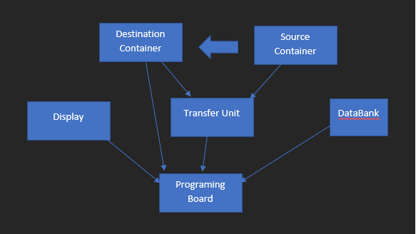
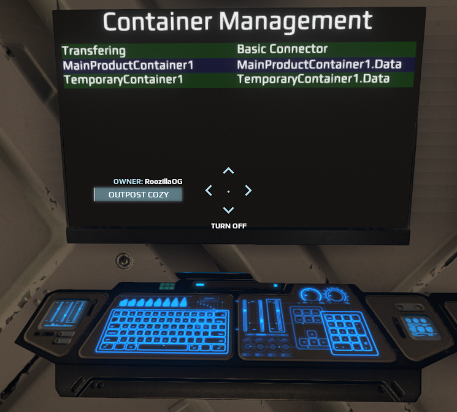

# Overview
This PB/Display unit handles automatically transfering contents from a source container to a destination container. 
It also updates a display indicating the state of transfer and DataNode keys for input and output container.

# Details
## The main code is in unit.onStart__.0.lua.
1. Create a list of transfer managers, each taking
   - A slot name for the transfer Industry unit
   - A slot name for the input container
2. A list of container monitors, each taking
   - A string name for the container. This will be used to index the DataBank
   - A slot name for the container from the PB
   - A slot name for the DataBank to be used to store content data
3. Set up update timers to periodicically check for new transfers and update container content data

## The display code is in Display1.lua
Takes json data from scriptInput and populates a UiTable2 with information on the transfer

# Usage
## Setup

1. Link a Transfer Industry unit to the PB
2. Link an output container to the Transfer unit
2. Link an input container to the PB
3. Link a display/screen to the PB
4. Link a DataBank to the PB
4. Update/modify the slot names between the PB and the code

## Link Diagram

## In Game Image

## Notes

- Note that each item has a minimum transfer size, this means that you will still have
items sitting in the input container if the current quanitity is less than the minimum transfer quantity.