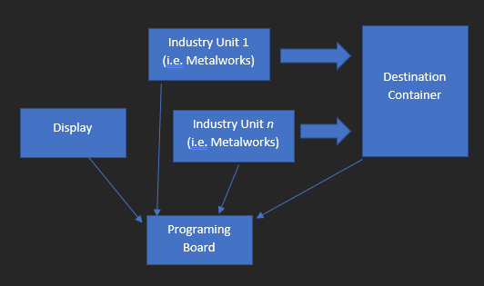
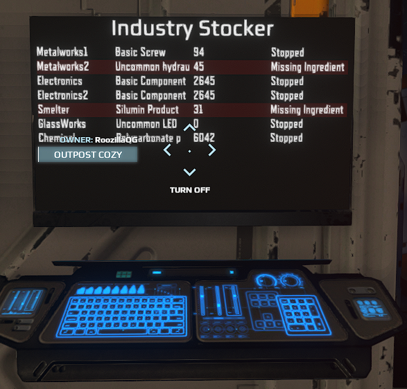

# Overview
This PB/Display unit handles automatically stocking items to a desired quantity for multiple Industry
units. Status is displayed to a display, comment out the DisplayData section if you want a headerless setup.

# Details
## The main code is in unit.onStart__.0.lua.
1. Create a list of IndustryStockers
   - A display name for the stocker
   - A resource object that maps displaynames <-> ids
   - A slot name for Industry unit you want to manage
   - A table that maps display names to desired quantity for an item
2. A DisplayData object
   - A list of stockers (created above)
   - A ContainerData object for the output container to check quantities on
   - A slot name for the Display
3. Set up update timers to periodicically check for new transfers and update container content data

## The display code is in Display1.lua
Takes json data from scriptInput and populates a UiTable2 with information on the transfer

# Usage
## Setup

1. Link *n* number of Industry Units (i.e. Metalworks, 3DPrinter, etc..)
2. Link an output container to the Transfer unit
3. Link a display/screen to the PB
4. Update/modify the slot names between the PB and the code for your set of Industry units

## Link Diagram

## In Game Image

## Notesimage.png

- Note that often you can combine the TransferManager with this unit by linking the output container as the input container to the TransferManager